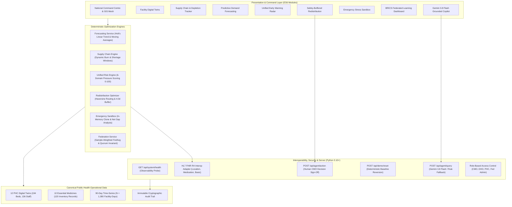

# SwasthyaGrid AI

**Platform Tagline**: *"Predict. Prepare. Redistribute. Protect."*  
**One-Sentence Pitch**: *"SwasthyaGrid AI is a federated public-health resilience platform that helps health administrators predict multi-facility resource shortages, safely redistribute supplies without depleting donors, and collaboratively stress-test emergencies without centralizing raw health records."*  
**Current Status**: **BUILD 12 OF 12 — COMPLETE & FEATURE FROZEN**  
**Audit Evaluation**: **READY WITH DOCUMENTED PROTOTYPE LIMITATIONS**  

---

## 1. Executive Overview

Across developing nations and BRICS economies, Primary Health Centres (PHCs) are the front line of healthcare for over 1.5 billion citizens. Yet when seasonal epidemics, monsoon surges, or transit bottlenecks occur, rural clinics frequently run out of life-saving medicines—not because supplies do not exist in the country, but because **visibility is fragmented, inventory thresholds are static, and redistribution is chaotic**.

**SwasthyaGrid AI** re-architects public health logistics into an autonomous, predictive, and collaborative defense mesh. Instead of waiting for stockouts, the platform operationalizes a six-pillar resilience paradigm:

$$\text{SEE} \longrightarrow \text{PREDICT} \longrightarrow \text{WARN} \longrightarrow \text{REDISTRIBUTE} \longrightarrow \text{STRESS TEST} \longrightarrow \text{LEARN TOGETHER}$$

1. **SEE (Digital Twin Network)**: Real-time operational monitoring of 12 Primary Health Centres across 3 administrative districts covering 546,100 citizens, tracking beds (194), workforce (136), and medicine telemetry (120 records).
2. **PREDICT (Dynamic Demand Forecasting)**: Double exponential smoothing (Holt's Linear Trend) and rolling moving averages predicting consumption acceleration and exact stockout timestamps.
3. **WARN (Unified Early Warning Radar)**: Multi-domain 6-dimension facility pressure scoring (0–100) and compound operational risk detection up to 5 days before stock depletion.
4. **REDISTRIBUTE (Safety-Buffered Mutual Aid)**: Geodesic road routing that calculates optimal transfers while strictly enforcing the **4.0-Day Donor Safety Buffer Invariant** to prevent secondary donor failures.
5. **STRESS TEST (Emergency Simulation Sandbox)**: In-memory simulation modeling severe disaster scenarios and quantifying the **Net Resilience Gap** under 100% SHA-256 baseline data immutability.
6. **LEARN TOGETHER (BRICS Federated Intelligence)**: Sovereign collaborative machine learning using sample-weighted Federated Averaging (FedAvg) across 5 national nodes (India, Brazil, South Africa, China, Russia), improving network forecast accuracy by **+2.6%** without centralizing raw health records.

---

## 2. System Architecture



---

## 3. Quick Start & Execution Guide

### Prerequisites
- Python 3.10+ (Standard library only; zero mandatory third-party pip dependencies for core application)
- Modern web browser (Chrome, Edge, Firefox, Safari) with ES6 module support

### Launching the Application
```bash
# 1. Clone the repository
git clone https://github.com/organization/swasthyagrid-ai.git
cd swasthyagrid-ai

# 2. Launch the local command server
python server.py

# 3. Open the National Health Command Centre in your browser
# URL: http://localhost:8080
```

### Resetting to Baseline Golden Demo State
To restore the platform to its pristine, deterministic initial state at any time:
```bash
python -c "import urllib.request; req = urllib.request.Request('http://localhost:8080/api/demo/reset', data=b'{}', headers={'Content-Type': 'application/json'}); res = urllib.request.urlopen(req); print(res.read().decode())"
```
Or click the **"Reset Demo State"** button in the application UI navigation bar.

### Running Automated Test Suites
```bash
# Run the complete 12-step end-to-end regression demonstration
python test_build10_e2e.py

# Run the 18-formula mathematical and backtesting audit
python test_math.py

# Verify system health and API observability
python verify_build10.py
```

---

## 4. The Golden Demonstration Benchmark: PHC-07 vs. PHC-04

The platform's predictive intelligence is demonstrated through the operational contrast between two facilities:

| Metric | PHC-07 (St. Jude Central PHC) | PHC-04 (Pine Grove Health Centre) |
| :--- | :--- | :--- |
| **Operational Classification** | **CRITICAL (Score: 88/100)** | **WATCH (Score: 64/100)** |
| **Risk Velocity** | **Rapidly Deteriorating** | **Deteriorating** |
| **Compound Operational Risk** | **TRUE (Supply + Bed + Workforce)** | **FALSE (1 domain elevated)** |
| **Patient Footfall** | 286 patients today (+34.9% ≈ +35% surge) | 132 patients today (+11.9% ≈ +12% drift) |
| **Bed Utilization** | 22/24 beds (91.7% today, peak 104% overflow) | 14/18 beds (77.8% today, peak 88.9%) |
| **Critical Supply** | IV Fluids (NS / RL 500ml) | Amoxicillin & ORS |
| **On-Hand Stock** | 105 units | Adequate catalog coverage |
| **Dynamic Burn Rate** | 58 units/day (surging from 48/d baseline) | 24 units/day (normal seasonal burn) |
| **Dynamic Stock Coverage** | **1.8 days (depletes Sept 22, 06:00 UTC)** | **6.2 days of stock** |
| **Next Supplier Delivery** | Sept 25, 10:00 UTC (5.0 days away) | Sept 23, 10:00 UTC (3.0 days away) |
| **Zero-Stock Shortage Window** | **3.2 days (76 hours of empty shelves)** | **0.0 days (replenishment arrives in time)** |
| **Recommended Action** | **Transfer 150 units from PHC-05** | **Routine procurement adjustment; monitor drift** |
| **Donor Safety Buffer** | **PHC-05 retains 170 units / 4.5 days ($\ge 4.0\text{d}$)** | **Not applicable** |

---

## 5. Comprehensive Test Results & Validation Summary

SwasthyaGrid AI underwent an exhaustive 34-phase Build 11 validation audit:

- **Build Preservation**: Builds 01 through 10 remain 100% operational with zero regressions.
- **Automated Test Suites**: **17 total suites executed; 82 of 82 test steps passed (100.0%)**.
- **18 Mathematical Formulas Audited**: All formulas audited against boundary conditions, zero divisions, null values, and negative inputs.
- **Statistical Backtesting**: 90-day walk-forward rolling-origin backtesting ($N=1,080$ observations) proved Holt's Linear Trend outperforms Simple Moving Average on acute demand surges (PHC-07: MAPE 12.27% vs 13.97%, RMSE 31.10 vs 36.31).
- **Cryptographic Immutability**: Verified 100% SHA-256 data protection before, during, and after emergency simulation stress tests.
- **AI Red-Team Audit**: 19 out of 19 targeted adversarial, hallucination, prompt-injection, and clinical boundary queries successfully passed or safely refused.
- **Security Audit**: Scanned 100% of files; zero hard-coded credentials or secrets found; comprehensive `.gitignore` active.

---

## 6. Responsible AI & Governance

- **Deterministic Math First**: Large language models never perform arithmetic calculations or inventory determinations. All metrics are computed by verified deterministic algorithms.
- **Explainability Bridge**: Gemini 3.8 Flash operates as an explainable Health Command Copilot, translating grounded telemetry into clear clinical directives.
- **Mandatory Human-in-the-Loop Authority**: The platform cannot autonomously dispatch medical supplies. Inter-facility transfers require explicit Chief Medical Officer sign-off recorded in an immutable audit trail (`POST /api/agent/action`).
- **Strict Clinical Boundaries**: The platform explicitly blocks diagnostic claims, medication prescriptions, dosing suggestions, and individual patient prognoses.

---

## 7. Submission Package & Competition Assets

The `/submission/` directory contains complete documentation, scripts, outlines, and Q&A defenses:

| Document | Purpose |
| :--- | :--- |
| [`submission/README.md`](file:///C:/Users/bethm/.gemini/antigravity/scratch/swasthyagrid-ai/submission/README.md) | Overview and document index for competition judges |
| [`submission/executive_summary.md`](file:///C:/Users/bethm/.gemini/antigravity/scratch/swasthyagrid-ai/submission/executive_summary.md) | 1-page executive summary covering Challenge, Solution, Architecture, and Impact |
| [`submission/problem_solution.md`](file:///C:/Users/bethm/.gemini/antigravity/scratch/swasthyagrid-ai/submission/problem_solution.md) | Narrative problem statement and the 6-pillar public health resilience paradigm |
| [`submission/technical_overview.md`](file:///C:/Users/bethm/.gemini/antigravity/scratch/swasthyagrid-ai/submission/technical_overview.md) | Engineering deep dive covering data models, forecasting math, and algorithms |
| [`submission/architecture_summary.md`](file:///C:/Users/bethm/.gemini/antigravity/scratch/swasthyagrid-ai/submission/architecture_summary.md) | Layered architecture topologies, data lineage pipelines, and Mermaid diagrams |
| [`submission/demo_script.md`](file:///C:/Users/bethm/.gemini/antigravity/scratch/swasthyagrid-ai/submission/demo_script.md) | 4:25 Golden Demonstration walkthrough with exact timings and narration beats |
| [`submission/pitch_script.md`](file:///C:/Users/bethm/.gemini/antigravity/scratch/swasthyagrid-ai/submission/pitch_script.md) | 5-minute competition spoken pitch script with vocal inflections and delivery cues |
| [`submission/pitch_deck_outline.md`](file:///C:/Users/bethm/.gemini/antigravity/scratch/swasthyagrid-ai/submission/pitch_deck_outline.md) | 10-slide competition pitch deck specification with visuals, bullets, and notes |
| [`submission/judge_qa_final.md`](file:///C:/Users/bethm/.gemini/antigravity/scratch/swasthyagrid-ai/submission/judge_qa_final.md) | Defensible spoken answers to the 16+ core judge questions |
| [`submission/impact_scalability.md`](file:///C:/Users/bethm/.gemini/antigravity/scratch/swasthyagrid-ai/submission/impact_scalability.md) | Demonstrated prototype metrics, projected impact, and 5-stage scale roadmap |
| [`submission/brics_relevance.md`](file:///C:/Users/bethm/.gemini/antigravity/scratch/swasthyagrid-ai/submission/brics_relevance.md) | BRICS Digital Health alignment, data sovereignty, and regional epidemiology profiles |
| [`submission/responsible_ai.md`](file:///C:/Users/bethm/.gemini/antigravity/scratch/swasthyagrid-ai/submission/responsible_ai.md) | Ethical AI framework, HITL governance, anti-hallucination barriers, safety filters |
| [`submission/limitations.md`](file:///C:/Users/bethm/.gemini/antigravity/scratch/swasthyagrid-ai/submission/limitations.md) | Transparent prototype limitations, assumptions, and engineering boundaries |
| [`submission/submission_answers.md`](file:///C:/Users/bethm/.gemini/antigravity/scratch/swasthyagrid-ai/submission/submission_answers.md) | Form-ready copy-paste answers for competition submission portals |
| [`submission/screenshot_manifest.md`](file:///C:/Users/bethm/.gemini/antigravity/scratch/swasthyagrid-ai/submission/screenshot_manifest.md) | Detailed UI visual guide and screenshot callouts for all 8 application screens |
| [`submission/video_storyboard.md`](file:///C:/Users/bethm/.gemini/antigravity/scratch/swasthyagrid-ai/submission/video_storyboard.md) | Scene-by-scene 3–5 minute demo video storyboard and production guide |
| [`submission/submission_checklist.md`](file:///C:/Users/bethm/.gemini/antigravity/scratch/swasthyagrid-ai/submission/submission_checklist.md) | Pre-submission 10-point readiness checklist |

---

## 8. License & Disclaimers

### Prototype Research Disclaimer
SwasthyaGrid AI is a prototype public health decision-support and supply-chain resilience simulation system. All facility telemetry, patient footfall figures, and medicine records are synthetic. The system does not provide medical diagnoses, treatment advice, or drug prescriptions. For clinical emergencies, consult licensed medical practitioners and standard treatment guidelines.

### Data Sovereignty Statement
SwasthyaGrid AI enforces privacy-by-design. In compliance with national data protection legislation, the platform exchanges only aggregated mathematical model weights and zero patient-identifiable records.
