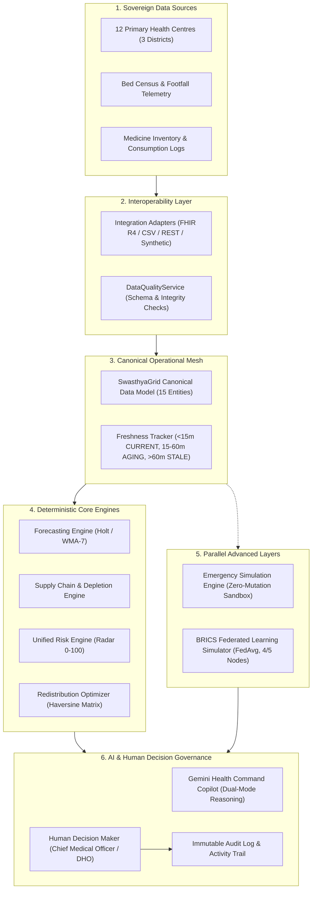

# SwasthyaGrid AI — Comprehensive Technical Architecture Document

> **"Predict. Prepare. Redistribute. Protect."**  
> *AI-Powered Federated Public-Health Resource & Supply-Chain Resilience Platform for National-Scale Primary Health Centre Networks*  
> **Document Version**: 1.0.0-PROD-READY  
> **Build Target**: Build 10 — Integration, Interoperability, Security, Observability & Hardening  

---

## 1. Executive Technical Overview

SwasthyaGrid AI is a national-scale public-health operational resilience platform designed to safeguard Primary Health Centre (PHC) networks against sudden demand surges, localized epidemic clusters, and critical supply-chain ruptures.

Historically, primary healthcare networks operate reactively: facility stock-outs, inpatient bed saturation, and clinical workforce shortages are detected only after stock is completely exhausted or clinical queues overflow. Furthermore, traditional central data aggregation introduces severe privacy, data sovereignty, and regulatory barriers across municipal, state, and national borders.

SwasthyaGrid AI solves these structural challenges through a four-pillar operational architecture:
1. **Predictive Horizon (Builds 01–04)**: Deterministic 7-day mathematical forecasting of patient footfall, dynamic medicine burn, and bed saturation using Holt's linear trend, weighted moving averages, and seasonal adjustments.
2. **Dual-Mode Clinical AI (Build 05)**: Gemini 3.8 Flash integrated with a grounded deterministic fallback engine, offering explainable operational directives without autonomous execution risk.
3. **Unified Risk & Inter-Facility Redistribution (Builds 06–07)**: Automated compound risk scoring (0–100) and Haversine-optimized donor-recipient resource reallocation that strictly preserves donor safety buffers.
4. **Stress Testing & Federated Intelligence (Builds 08–09)**: Sandboxed emergency simulation for resilience gap analysis, coupled with privacy-preserving BRICS federated learning (FedAvg) that exchanges only parameter weights while raw operational records remain strictly sovereign.

---

## 2. System Architecture & High-Level Topology



---

## 3. Component Architecture & Directory Structure

```
swasthyagrid-ai/
├── css/
│   └── styles.css                  # Custom styling, animations, Leaflet map styling
├── index.html                      # Entry HTML shell with Tailwind, Leaflet, Chart.js
├── server.py                       # Python HTTP daemon with static serving + REST API
├── src/
│   ├── app.js                      # Application root orchestrator
│   ├── ai/
│   │   └── health_command_agent.js # Gemini 3.8 Flash client bridge
│   ├── config/
│   │   ├── forecasting_config.js   # Forecast horizon and statistical weights
│   │   ├── redistribution_config.js# Buffer constraints & Haversine penalties
│   │   ├── simulation_config.js    # Scenario stress-test parameters
│   │   └── federation_config.js    # BRICS node specifications & hyperparameters
│   ├── data/
│   │   ├── phc_dataset.js          # 12 PHCs across 3 districts with coordinates
│   │   ├── medicine_dataset.js     # 120 inventory records, 10 essential medicines
│   │   └── historical_dataset.js   # 30-day historical footfall time-series
│   ├── logic/
│   │   ├── system_health_service.js # Subsystem status, freshness, observability
│   │   ├── data_quality_service.js  # Schema validation & integrity scorecard
│   │   ├── interoperability_adapter.js # FHIR-style mappings & canonical adapters
│   │   ├── security_service.js      # RBAC simulation & AI safety boundaries
│   │   ├── audit_service.js         # Consolidated audit log & event queries
│   │   ├── forecasting_service.js   # Mathematical forecasting models
│   │   ├── supply_chain_engine.js   # Stock coverage & dynamic depletion
│   │   ├── unified_risk_engine.js   # Compound risk radar & early warnings
│   │   ├── redistribution_engine.js # Haversine donor matching & optimization
│   │   ├── simulation_engine.js     # Sandboxed resilience stress-testing
│   │   └── federated_service.js     # Federated learning aggregation (FedAvg)
│   └── ui/
│       ├── router.js                # Hash router with error boundaries
│       ├── components/              # 18 modular UI components (TopBar, Sidebar, etc.)
│       └── views/                   # 12 complete views (Overview, Twin, Reports, etc.)
├── architecture.md                 # Complete technical architecture specification
├── walkthrough.md                  # Comprehensive implementation walkthrough
└── implementation_plan.md          # Multi-build progression & verification plan
```

---

## 4. End-to-End Data Flow & Lineage Case Study: PHC-07 IV Fluids

To guarantee transparency and explainability, SwasthyaGrid AI enforces a deterministic 10-step data lineage:

```
[1. Raw Synthetic Inventory]
105 units IV Fluids recorded at PHC-07; delivery scheduled Sept 25 (5.0 days away).
       ↓
[2. Data Quality & Integrity Validation]
DataQualityService validates foreign keys, non-negative bounds, and date validity (100% Score).
       ↓
[3. Dynamic Consumption Calculation]
Baseline burn is 48 units/day. Due to dehydration cluster, rate accelerates to 58 units/day (+21%).
       ↓
[4. 7-Day Demand Forecasting]
Forecasting service detects footfall surge (+35%, 286 patients) and projects 104% bed saturation (25/24 beds).
       ↓
[5. Stock-Out & Depletion Projection]
105 units / 58 units/day = 1.8 days of coverage (depletion Sept 22, 06:00 UTC). Unbuffered deficit: 3.2 days.
       ↓
[6. Risk Signal Formulation]
Unified Risk Engine aggregates metrics into Compound Risk (Severity: 94/100, Velocity: Rapid).
       ↓
[7. Early Warning Alert Published]
ALT-COMPOUND-PHC-07 broadcast to National Command Centre and District Central dashboards.
       ↓
[8. Redistribution Optimization]
Haversine matrix identifies PHC-05 (320 units). 150-unit transfer preserves 4.5-day donor buffer (min 4.0d).
       ↓
[9. Gemini Health Copilot Synthesis]
Dual-mode AI explains the clinical context, highlights the 3.2-day gap, and details transfer trade-offs.
       ↓
[10. Human Decision Authorization]
Chief Medical Officer approves transfer TX-REC-001, assigns Driver R. Kumar, and writes immutable audit entry.
```

---

## 5. Healthcare Interoperability & Canonical Data Model

### Conceptual FHIR R4 Resource Mappings
SwasthyaGrid AI maps its operational telemetry to HL7 FHIR concepts without requiring patient-level clinical records:

| FHIR R4 Resource | SwasthyaGrid Concept | Canonical Entity | Key Fields Mapped |
|:---|:---|:---|:---|
| `Organization` | District Health Administration | `District` | `district_id`, `district_name`, `state_authority` |
| `Location` | Primary Health Centre (PHC) | `Facility` | `phc_id`, `phc_name`, `coordinates { lat, lng }`, `phc_type` |
| `HealthcareService` | PHC Operational Capabilities | `Capacity` | `providedBy`, `service_type` (OP, IP, Pharmacy), `active` |
| `PractitionerRole` | Staff Attendance & Shifts | `Workforce` | `organization`, `role_title`, `availableTime`, `status` |
| `Medication` | Essential Medicine Master | `Medicine` | `medicine_id`, `generic_name`, `dosage_form`, `atc_code` |
| `SupplyDelivery` | Inbound Shipments & Transfers | `Delivery`, `TransferRecommendation` | `supplier`, `destination`, `suppliedItem`, `quantity`, `status` |
| `Encounter` | Aggregated Daily Footfall | `Consumption` | `serviceProvider`, `period`, `inpatient_count`, `outpatient_count` |

### 15 Canonical Data Model Entities
1. `Facility`: Unique healthcare facility node with geospatial coordinates and district linkage.
2. `District`: Administrative clustering of facilities with governance boundaries.
3. `Medicine`: Essential drug specification, dosage form, and clinical category.
4. `Inventory`: Real-time on-hand stock, batch identifiers, and expiry dates.
5. `Consumption`: Historical and current burn rate (units/day).
6. `Capacity`: Inpatient bed counts, current occupancy, and rated surge capacity.
7. `Workforce`: Attendance, active shifts, and clinical staffing ratios.
8. `Delivery`: Scheduled inbound manufacturer replenishment orders.
9. `Forecast`: 7-day projected patient footfall, medicine burn, and bed saturation.
10. `RiskSignal`: Individual threshold breach signal (e.g. stockout, bed pressure).
11. `Alert`: Compound operational alert with lifecycle states (`ACTIVE`, `ACKNOWLEDGED`, `RESOLVED`).
12. `TransferRecommendation`: Inter-facility redistribution directive with donor safety validation.
13. `SimulationScenario`: Sandboxed parameter set for emergency stress-testing.
14. `FederationNode`: Sovereign national learning participant.
15. `ModelVersion`: Global federated model release (`GLOBAL-004`) with accuracy telemetry.

---

## 6. Security Architecture & RBAC Simulation

### Security Boundaries
- **Authentication Boundary**: In the production roadmap, OAuth2 / OIDC with PKCE handles identity federation. In the prototype, simulated role switching allows seamless evaluation of persona capabilities.
- **Authorization & RBAC Matrix**:
  - `PHC Officer`: Scoped strictly to facility-level data (e.g. PHC-07); can view local stock, acknowledge facility alerts.
  - `District Health Officer`: Scoped to district facilities (e.g. District Central); can approve intra-district transfers.
  - `State/National Administrator`: Full operational view across all 12 PHCs; authorizes cross-district redistribution and emergency policies.
  - `Federation Administrator`: Manages cross-border model aggregation, drift detection, and deployment governance.
- **Secrets Protection**:
  - Zero API keys are hardcoded in client-side code.
  - All Gemini interactions route through the local server daemon (`server.py`), reading credentials from environment variables (`GEMINI_API_KEY`).
  - `.gitignore` prevents environment files, tokens, or credential caches from entering version control.
- **AI Security & Separation of Concerns**:
  - Rigid separation between `[SYSTEM INSTRUCTION]`, `[USER QUERY]`, and `[STRUCTURED OPERATIONAL CONTEXT]`.
  - Operational context is treated strictly as untrusted data.
  - Prompt injection defense: Gemini is explicitly configured with **zero autonomous execution privileges** (cannot alter inventory, dispatch vehicles, or approve budgets).

---

## 7. Observability, Data Quality & Freshness

### Platform Subsystems Health
The `system_health_service.js` continuously monitors 8 subsystems:
1. `operational_dataset`: HEALTHY (12/12 PHC records online)
2. `forecasting_engine`: HEALTHY (7-day horizon active, 92% confidence)
3. `supply_chain_engine`: HEALTHY (Dynamic depletion tracking active)
4. `risk_engine`: HEALTHY (Compound risk radar active)
5. `redistribution_optimizer`: HEALTHY (Haversine routing calibrated)
6. `simulation_engine`: HEALTHY (Zero-mutation sandbox isolated)
7. `gemini_service`: HEALTHY (Dual-mode reasoning active)
8. `federation_simulator`: HEALTHY (Round 004 active, 4/5 nodes)

### Data Freshness Categorization
- `< 15 minutes`: `CURRENT` (Green badge)
- `15–60 minutes`: `AGING` (Amber badge)
- `> 60 minutes`: `STALE` (Red badge)
- Stale data is never silently presented as current; AI summaries receive freshness metadata.

### Data Quality Scorecard
`DataQualityService` validates datasets against 10 rules: missing IDs, negative inventory, impossible dates, missing historical periods, invalid forecasts, invalid capacity, duplicate records, broken PHC references, broken medicine references, and invalid federation payloads.
- **Current Score**: **100% Integrity** (0 Errors, 0 Warnings, 0 Missing Values).

---

## 8. Deployment Pathway & Production Roadmap

```
Phase 1: Local Hardened Prototype (Complete - Build 10)
  ↓
Phase 2: Containerization (Docker + Kubernetes / Cloud Run)
  - Split frontend SPA and backend API services
  - Deploy PostgreSQL / Spanner for transactional state
  ↓
Phase 3: Real Standards Integration
  - Connect to National Health Service FHIR APIs (ABDM / Ayushman Bharat Digital Mission)
  - Integrate GPS vehicle tracking via OSRM / Google Maps Platform
  ↓
Phase 4: Cryptographic Federation
  - Upgrade FedAvg to Secure Multi-Party Computation (SMPC) or Differential Privacy (DP-SGD)
  - Formalize BRICS health ministry data governance agreements
```

---

## 9. Explicit Claim Boundaries & Non-Goals

| Dimension | In-Scope (Delivered) | Out-of-Scope (Strict Non-Claims) |
|:---|:---|:---|
| **Data Scope** | 100% Synthetic public health operational data | Real patient records or Protected Health Information (PHI) |
| **Clinical Role** | Resource forecasting & logistics decision-support | Clinical diagnosis, triage algorithms, or treatment advice |
| **Procurement** | Inter-facility transfer optimization recommendations | Autonomous physical procurement or financial disbursement |
| **Federation** | Deterministic simulation of federated averaging (FedAvg) | Production cross-border zero-knowledge cryptography |
| **System Role** | Advisory decision-support for human administrators | Replacement of Chief Medical Officers or Health Ministers |

---

*SwasthyaGrid AI Architecture Document — Approved for Final Submission.*
