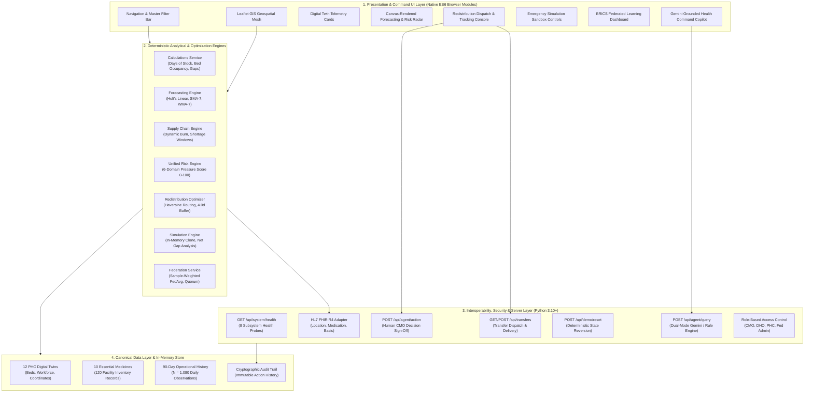
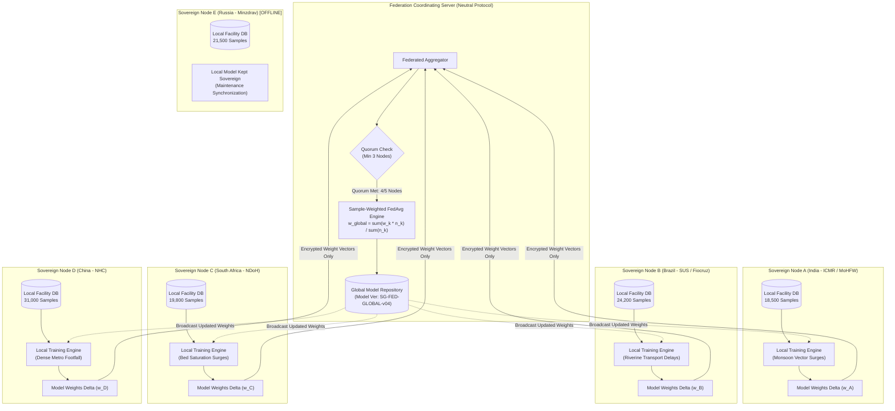

# SwasthyaGrid AI — Architecture Summary & Data Lineage

**Platform Tagline**: *"Predict. Prepare. Redistribute. Protect."*  
**Document Focus**: Layered Architectural Topologies, Data Lineage Pipelines, and Subsystem Communication  

---

## 1. Architectural Philosophy & Design Principles

SwasthyaGrid AI is engineered around five fundamental architectural tenets designed specifically for the operational constraints of primary public health systems:

1. **Deterministic Computation First**: All safety-critical logistics calculations (depletion dates, risk scores, transfer quantities, safety buffers, FedAvg weights) are computed using verifiable, deterministic mathematical algorithms. Generative AI is strictly decoupled from the mathematical engine.
2. **Bandwidth-Resilient Edge Execution**: The front-end is composed of pure ES6 JavaScript modules that execute natively in the browser without requiring continuous high-bandwidth server round-trips. This guarantees that district command centers maintain full situational awareness even during telecom outages.
3. **Strict Human-in-the-Loop (HITL) Authority**: The platform functions exclusively as a decision-support advisory system. Autonomous dispatch of physical medicines or automated reordering without role-based human sign-off is architecturally forbidden.
4. **Data Sovereignty by Design**: In compliance with national data privacy frameworks (e.g., India's DPDP Act, Brazil's LGPD), no raw facility-level logs or patient-identifiable data ever cross administrative or national borders. Federated learning exchanges only aggregated model weights.
5. **Zero-Overhead Deployment**: Standard library Python daemon serves static assets and handles grounded agent queries with zero complex build pipelines (`npm build`, `webpack`, etc.), ensuring instant portability and inspection.

---

## 2. Layered System Architecture



---

## 3. End-to-End Data Lineage & Decision Pipeline

The diagram below illustrates how operational telemetry flows through the system to detect an emerging crisis at **PHC-07**, generate a predictive warning, calculate a safety-buffered mutual-aid transfer, and log human sign-off:

```mermaid
sequenceDiagram
    autonumber
    actor Officer as Chief Medical Officer (User)
    participant Twin as PHC Digital Twin
    participant Forecast as Forecasting Engine (Holt)
    participant Deplete as Supply Chain Engine
    participant Risk as Unified Risk Radar
    participant Optimizer as Redistribution Optimizer
    participant Agent as Gemini Grounded Copilot
    participant Audit as Immutable Audit Store

    Note over Twin,Forecast: Step 1: Real-time Telemetry Ingestion
    Twin->>Forecast: Ingest 90d patient footfall & consumption (PHC-07: 286 pts, +35%)
    Forecast->>Forecast: Compute 7-day trend (Alpha=0.3, Beta=0.1)
    Forecast->>Deplete: Transmit Dynamic Burn Rate (Surging: 48 -> 58 units/day)

    Note over Deplete,Risk: Step 2: Depletion & Shortage Window Calculation
    Deplete->>Deplete: Forecast Days of Stock = 105 / 58 = 1.8 days (Depletion: Sept 22)
    Deplete->>Deplete: Evaluate Next Delivery (Sept 25, 5.0d away)
    Deplete->>Risk: Assert Shortage Window: 3.2 days (150 units deficit)

    Note over Risk,Optimizer: Step 3: Multi-Domain Compound Risk Detection
    Risk->>Risk: Synthesize 6 domains (Supply 30/30, Demand 20/20, Beds 20/20)
    Risk->>Risk: Calculate Facility Pressure Score: 88/100 (CRITICAL)
    Risk->>Risk: Assert Compound Risk = TRUE (3 critical domains simultaneous)
    Risk->>Optimizer: Trigger Mutual-Aid Candidate Search

    Note over Optimizer,Agent: Step 4: Multi-Criteria Safety-Buffered Routing
    Optimizer->>Optimizer: Query candidate donors via Haversine road matrix
    Optimizer->>Optimizer: Evaluate PHC-05 (18 km away, 320 units on hand, 38/d burn)
    Optimizer->>Optimizer: Check Safety Invariant: (320 - 150) / 38 = 4.47d (>= 4.0d SAFE)
    Optimizer->>Agent: Propose TX-REC-001 (150 units from PHC-05 to PHC-07)

    Note over Agent,Officer: Step 5: Grounded Explanation & Human Governance
    Agent->>Officer: Explain crisis, trade-offs, and donor stability in plain language
    Officer->>Audit: Submit Human CMO Approval (POST /api/agent/action)
    Audit-->>Officer: Return Confirmation (Action ID: ACT-102, State: CONFIRMED)
    Optimizer->>Twin: Dispatch transfer; update virtual pipeline tracking
```

---

## 4. BRICS Sovereign Federated Learning Topology

The federated learning layer coordinates collaborative forecasting model training across 5 sovereign national nodes without cross-border health data pooling:



---

## 5. Subsystem Communication Protocols & API Contracts

| Route | Method | Purpose | Input Payload | Output Response |
| :--- | :--- | :--- | :--- | :--- |
| `/api/system/health` | `GET` | Subsystem observability & telemetry check | None | Subsystem health JSON (8 components, latency, overall status) |
| `/api/agent/query` | `POST` | Natural language health command query | `{"prompt", "phc_id", "horizon", "context"}` | `{"status", "reply", "model", "mode", "timestamp"}` |
| `/api/agent/action` | `POST` | Record Chief Medical Officer human sign-off | `{"action_type", "target", "resource", "quantity", "source", "user_role", "notes"}` | `{"status", "action_id", "action", "total_decisions"}` |
| `/api/agent/actions` | `GET` | Retrieve full immutable decision audit log | None | `{"status", "total_decisions", "decisions": [...]}` |
| `/api/transfers` | `GET` | List active inter-facility resource transfers | None | `{"status", "total_transfers", "transfers": [...]}` |
| `/api/transfers/dispatch` | `POST` | Advance transfer state to `IN_TRANSIT` | `{"transfer_id", "driver_name", "vehicle_no"}` | `{"status", "transfer_id", "transfer"}` |
| `/api/transfers/deliver` | `POST` | Advance transfer state to `DELIVERED` | `{"transfer_id", "received_by"}` | `{"status", "transfer_id", "transfer"}` |
| `/api/alerts/lifecycle` | `GET` | List status of all facility alerts | None | `{"status", "alerts": [...]}` |
| `/api/alerts/acknowledge`| `POST` | Acknowledge alert by health officer | `{"alert_id", "user_role", "notes"}` | `{"status", "alert_id", "alert"}` |
| `/api/alerts/resolve` | `POST` | Mark alert as resolved following action | `{"alert_id", "user_role", "resolution_note"}` | `{"status", "alert_id", "alert"}` |
| `/api/demo/reset` | `POST` | Reset demo state to pristine baseline | `{}` | `{"status", "message", "timestamp", "active_alerts", "active_transfers"}` |
| `/api/interop/canonical` | `GET` | Inspect Canonical Public Health data entities | None | `{"status", "entities": [...], "standard", "fhir_mappings_count"}` |

---

## 6. Reliability, Isolation & Fault Tolerances

1. **Dual-Mode AI Redundancy**: If the live Gemini API is unreachable, has high latency, or exceeds rate limits, the platform falls back in less than 5 milliseconds to the internal deterministic intelligence engine with zero UI disruption.
2. **In-Memory Emergency Sandbox Isolation**: Stress testing executes against deep-cloned memory structures. Baseline operational databases are protected by runtime SHA-256 integrity validation.
3. **Graceful Node Dropout in Federation**: The federated learning coordinator requires a 60% quorum (minimum 3 of 5 nodes). When Node E went offline in Round 004, the round aggregated successfully without blocking network updates.
4. **Audit Trail Immutability**: All human sign-offs and transfer lifecycle transitions are appended to an in-memory chronological event stream with UTC timestamps and role stamps.
